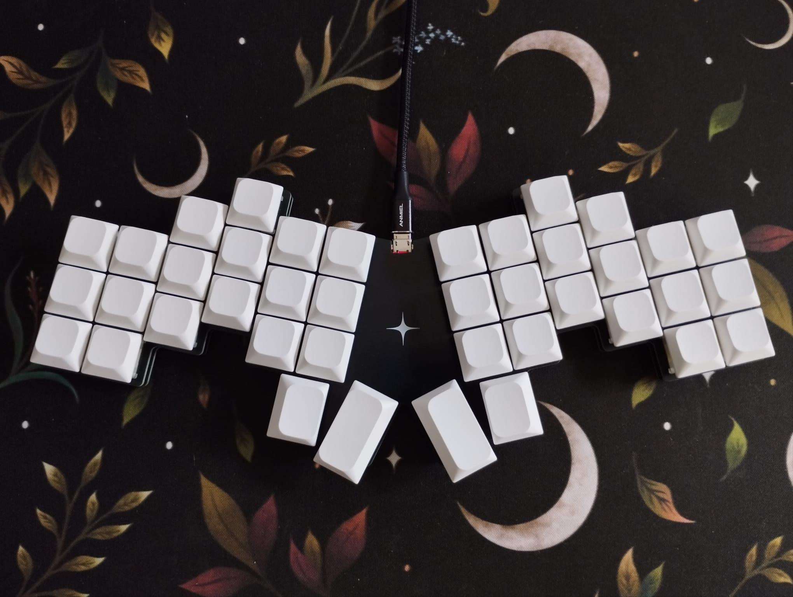

# yet-another-ergo

The climax of my split custom keyboard journey. My own custom ergo unibody keyboard.
Inspired by the [Cantor](https://github.com/diepala/cantor) and
[Kaly](https://github.com/Dwctor/Kaly).

Thanks to [FlatFootFox](https://flatfootfox.com/). Without your blog series this would not
have been possible.

### The why

I created this because I wasn't really satisfied with the available offerings, the 
closest thing to what I wanted was a [Cantor](https://github.com/diepala/cantor), which I
have built, but I wanted to try an even more aggressive stagger, which spurred the
creation of yet-another-ergo keyboard.

### The creation

Working on this was really fun. From designing the board, to creating the PCB and 
assembling it. Funnily enough the programming part, which I should have been most 
familiar with, was the most frustrating part. I found a lot of conflicting information 
online about how to set QMK up and how to use it. It seemed like there is a dozen ways 
to do the same thing, and using one breaks the other. The minimalist examples didn't 
really help either. I think I get how QMK works now, but in the end I gave up on 
creating my keymap in code, and simply used Vial (because Via can't do Tap-Dances?) to 
set it up. That's why the keymap.json is so barren :D

### The journey

I like mechanical keyboards, and I like modding and customizing them. After finding my
favorite TKL-ish keyboard, the Akko 5075, I started noticing that I made a lot of mistakes
when typing. So I set out to learn touch typing. Which was fine, but I soon learned that
my hands were not really the problem, but the keyboard layout. The german QWERTZ layout
absolutely sucks for programming, pretty much all the symbols are hard to reach and require
a modifier key.

I then found [Ben Vallack](https://www.youtube.com/@BenVallack)s YouTube channel, and
fell down the rabbit hole of split keyboards. They looked sick, and promised all these
benefits, but they also were incredibly expensive So I went all in and built myself a 
[Cheapino](https://github.com/tompi/cheapino).  
I loved it. Ortholinear keys for sensible finger movements, split design for better
ergonomics, and a thumb cluster to use the thumbs a bit more. However, after trying to use
it for programming I realized that I'm missing a few keys, and the numbers were hard to
type.  
So next up was the [Silakka54](https://github.com/Squalius-cephalus/silakka54). This is
where I stayed a bit and learned what I liked and what I didn't like. I definitely wanted
a more aggressive stagger, a more compact layout for less finger travel, and a thumb 
cluster that did not break my wrists when using it (seriously, wtf). I also would like 
for the keyboard to look nice.

This is when I started looking for the perfect keyboard for me, and honestly, the closest
thing I found was [Kaly](https://github.com/Dwctor/Kaly) a derivative of the Cantor, but
I didn't really like the design, I didn't want another split, and I wanted a smaller thumb
cluster. So at that point why not just design my own?

### Did I succeed?

No.

After starting the journey of creating my own keyboard I realized that I would not be 
able to achieve my initial goal of making less mistakes with such a keyboard. Maybe 
after years of use and a lot of fine-tuning.

#### What I don't like

- layer switching is a pain when typing fast
- typing numbers is hard, even with practice
- home-row mods (or for me bottom-row mods) are too inconsistent
- long typing sessions are actually uncomfortable, because of the forced use of my 
  pinky and ring finger
- I can't type some keys when my hand is on the mouse, which breaks my flow

##### What I like

- it's fun
- it looks cool
- ortholinear keys just make sense
- higher typing speed, with greater potential for improvement
- tap-dances for keys like ä, ö, ü, and ß are great
- the position of backspace, enter and escape on the outermost keys is great
- osm shift as a thumb key is great
- minimalist design and more space on the desk

### What's next?

I think I will stick with what I have for now. I will try to get used to it. If I 
can't, I will either go back to my lovely TKL or I will build another custom keyboard 
similar to the X-Bows Ergo, which I think is a pretty good compromise.

### Thank you

Thank you for reading this far. If you liked my little ramble, please consider
starring the project. I do need me some of that internet clout ;)
